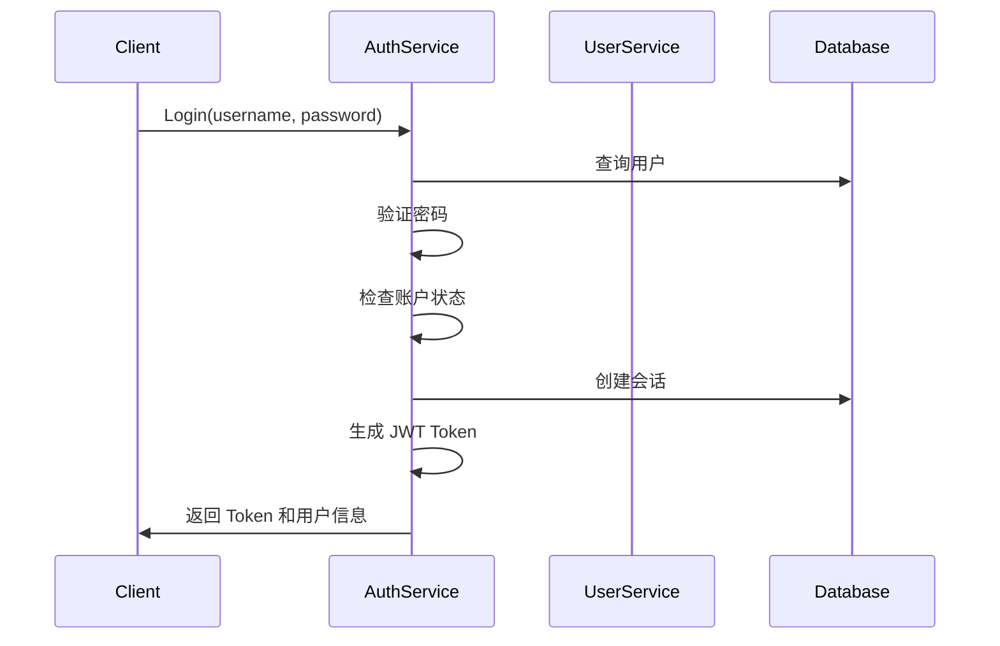
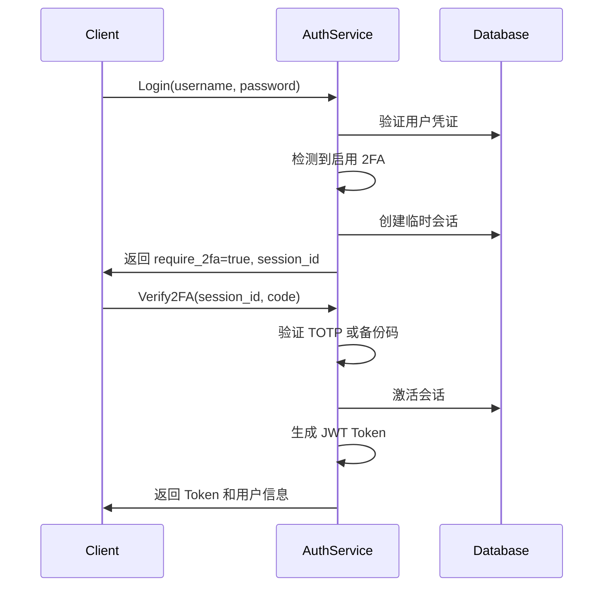
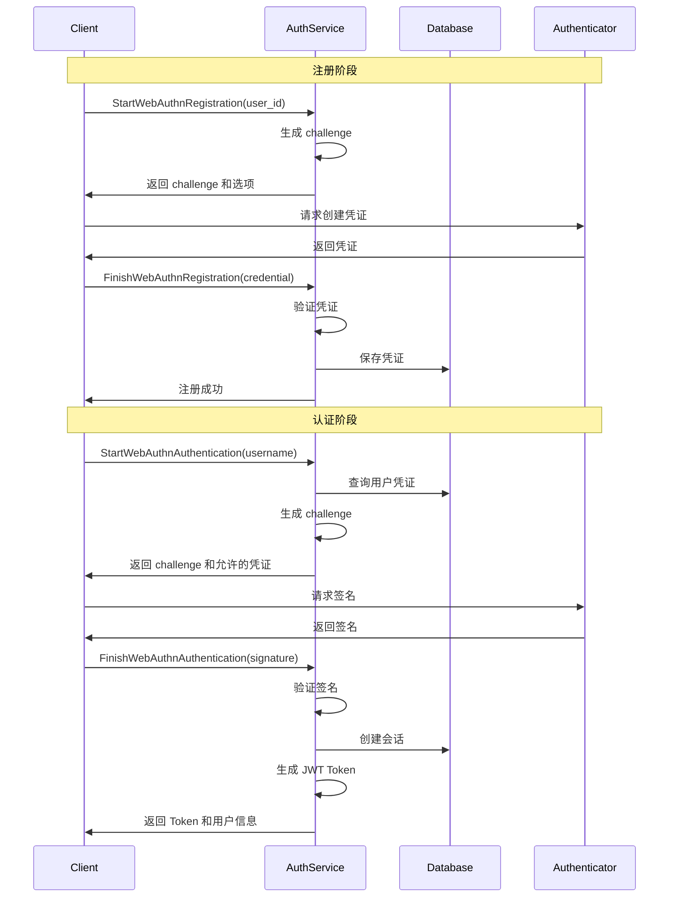

# IAM 身份服务 API 文档

## 概述

IAM Identity 服务提供完整的身份认证和用户管理功能，包括：

- 用户认证（密码、WebAuthn）
- 双因子认证（TOTP、备份码）
- 会话管理
- 密码重置
- 用户生命周期管理
- OAuth2 授权服务器（计划中）

## 服务信息

- **gRPC 端口**: 50051
- **健康检查端口**: 51051
- **包名**: `cuba.iam.auth`, `cuba.iam.user`

## 服务列表

### 1. [AuthService](./auth-service.md) - 认证服务

提供用户认证、会话管理、2FA、密码重置等功能。

**主要功能**：
- 用户登录/登出
- Token 刷新和验证
- 密码修改和重置
- 2FA 启用/禁用/验证
- 会话管理
- WebAuthn 无密码登录

### 2. [UserService](./user-service.md) - 用户管理服务

提供用户 CRUD、状态管理、角色分配等功能。

**主要功能**：
- 用户注册
- 用户信息查询和更新
- 用户状态管理（激活、停用、锁定）
- 角色分配和管理
- 用户列表查询

## 快速开始

### 1. 用户注册

```bash
grpcurl -plaintext -d '{
  "username": "john.doe",
  "email": "john@example.com",
  "password": "SecurePass123!",
  "display_name": "John Doe",
  "tenant_id": "default"
}' localhost:50051 cuba.iam.user.UserService/Register
```

### 2. 用户登录

```bash
grpcurl -plaintext -d '{
  "username": "john.doe",
  "password": "SecurePass123!",
  "tenant_id": "default",
  "device_info": "Chrome on macOS",
  "ip_address": "192.168.1.100"
}' localhost:50051 cuba.iam.auth.AuthService/Login
```

响应：
```json
{
  "access_token": "eyJhbGc...",
  "refresh_token": "eyJhbGc...",
  "expires_in": "3600",
  "token_type": "Bearer",
  "user": {
    "id": "550e8400-e29b-41d4-a716-446655440000",
    "username": "john.doe",
    "email": "john@example.com",
    "display_name": "John Doe"
  },
  "require_2fa": false
}
```

### 3. 使用 Access Token 调用 API

```bash
grpcurl -plaintext \
  -H "Authorization: Bearer eyJhbGc..." \
  -d '{"user_id": "550e8400-e29b-41d4-a716-446655440000"}' \
  localhost:50051 cuba.iam.user.UserService/GetUser
```

### 4. 刷新 Token

```bash
grpcurl -plaintext -d '{
  "refresh_token": "eyJhbGc..."
}' localhost:50051 cuba.iam.auth.AuthService/RefreshToken
```

## 认证流程

### 标准密码登录



### 双因子认证流程



### WebAuthn 无密码登录



## 安全特性

### 1. 密码安全

- 使用 Argon2id 哈希算法
- 密码强度验证（最小长度、复杂度）
- 密码历史记录（防止重用）

### 2. 账户保护

- 登录失败锁定（5 次失败锁定 15 分钟）
- 可疑登录检测（异常 IP、设备）
- 会话管理（单设备/多设备）

### 3. 双因子认证

- TOTP（Time-based One-Time Password）
- 备份码（10 个一次性使用）
- WebAuthn（FIDO2 硬件密钥）

### 4. Token 安全

- JWT 签名验证
- Token 过期时间（Access: 1 小时，Refresh: 7 天）
- Token 撤销支持

### 5. 租户隔离

- 所有数据按租户隔离
- Row-Level Security (RLS)
- 跨租户访问防护

## 监控指标

服务暴露以下 Prometheus 指标（`/metrics` 端点）：

### 认证指标

```prometheus
# 登录成功/失败次数
auth_login_total{status="success|failed", tenant_id="xxx"} 100

# 登录响应时间（毫秒）
auth_login_duration_ms{status="success|failed"} 50

# 2FA 使用率
auth_2fa_enabled_users{tenant_id="xxx"} 50
auth_2fa_total_users{tenant_id="xxx"} 100

# 账户锁定次数
auth_account_locked_total{tenant_id="xxx"} 5

# 可疑登录检测
auth_suspicious_login_total{tenant_id="xxx"} 3
```

### 会话指标

```prometheus
# 活跃会话数
auth_active_sessions{tenant_id="xxx"} 150

# 会话创建/撤销次数
auth_session_operations_total{operation="create|revoke", tenant_id="xxx"} 200
```

### WebAuthn 指标

```prometheus
# WebAuthn 注册/认证次数
auth_webauthn_operations_total{operation="register|authenticate", status="success|failed"} 50

# WebAuthn 凭证数量
auth_webauthn_credentials_total{tenant_id="xxx"} 30
```

## 错误码

| gRPC 状态码 | 错误场景 | 说明 |
|------------|---------|------|
| INVALID_ARGUMENT | 参数验证失败 | 用户名格式错误、密码强度不足等 |
| UNAUTHENTICATED | 认证失败 | 用户名或密码错误、Token 无效 |
| PERMISSION_DENIED | 权限不足 | 无权访问资源 |
| NOT_FOUND | 资源不存在 | 用户不存在、会话不存在 |
| ALREADY_EXISTS | 资源已存在 | 用户名或邮箱已被使用 |
| FAILED_PRECONDITION | 前置条件失败 | 账户已锁定、2FA 未启用 |
| RESOURCE_EXHAUSTED | 资源耗尽 | 登录尝试次数过多 |
| INTERNAL | 内部错误 | 数据库错误、服务不可用 |

## 最佳实践

### 1. Token 管理

```javascript
// 存储 Token
localStorage.setItem('access_token', response.access_token);
localStorage.setItem('refresh_token', response.refresh_token);

// 自动刷新 Token
async function refreshTokenIfNeeded() {
  const token = localStorage.getItem('access_token');
  const decoded = jwt_decode(token);
  
  // Token 即将过期（5 分钟内）
  if (decoded.exp * 1000 - Date.now() < 5 * 60 * 1000) {
    const refreshToken = localStorage.getItem('refresh_token');
    const response = await authService.refreshToken({ refresh_token: refreshToken });
    localStorage.setItem('access_token', response.access_token);
    localStorage.setItem('refresh_token', response.refresh_token);
  }
}
```

### 2. 错误处理

```javascript
try {
  const response = await authService.login(request);
  
  if (response.require_2fa) {
    // 跳转到 2FA 验证页面
    navigate('/verify-2fa', { session_id: response.session_id });
  } else {
    // 登录成功
    saveTokens(response);
    navigate('/dashboard');
  }
} catch (error) {
  if (error.code === 'UNAUTHENTICATED') {
    showError('用户名或密码错误');
  } else if (error.code === 'FAILED_PRECONDITION') {
    if (error.message.includes('locked')) {
      showError('账户已被锁定，请稍后再试');
    }
  } else {
    showError('登录失败，请重试');
  }
}
```

### 3. 会话管理

```javascript
// 定期检查会话状态
setInterval(async () => {
  try {
    const token = localStorage.getItem('access_token');
    await authService.validateToken({ access_token: token });
  } catch (error) {
    // Token 无效，跳转到登录页
    localStorage.clear();
    navigate('/login');
  }
}, 5 * 60 * 1000); // 每 5 分钟检查一次
```

## 相关文档

- [AuthService 详细文档](./auth-service.md)
- [UserService 详细文档](./user-service.md)
- [安全最佳实践](../../guides/security.md)
- [多租户指南](../../guides/multi-tenancy.md)
